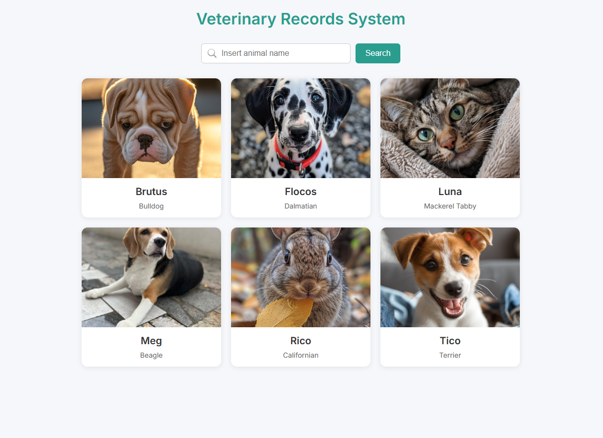
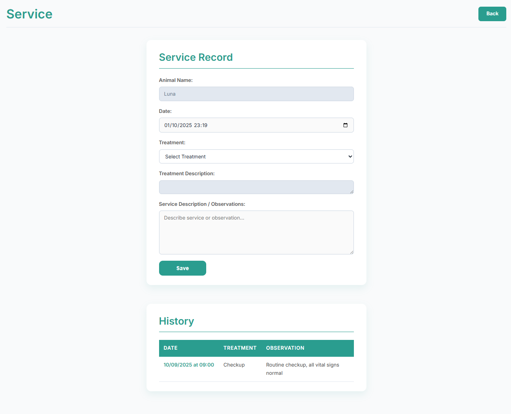

# Veterinary Record System 🐾📝




## 📌 Table of Contents

- [Veterinary Record System 🐾📝](#veterinary-record-system-)
  - [📌 Table of Contents](#-table-of-contents)
  - [🌐 Overview](#-overview)
  - [⚙️ Features](#️-features)
  - [💻 Technologies Used](#-technologies-used)
  - [🗝️ Key Takeaways](#️-key-takeaways)
  - [🚀 How to Run the Project](#-how-to-run-the-project)
    - [✅ Requirements](#-requirements)
    - [📦 Installation](#-installation)
    - [▶️ Running the Application](#️-running-the-application)
  - [🤝 Contributing](#-contributing)
  - [💬 Contact](#-contact)

## 🌐 Overview

**Veterinary Record System** is a PHP web app that uses PDO and MySQL to manage animal records. It follows the Model-View-Controller (MVC) architecture and applies Object-Oriented Programming (OOP) principles to organize code for viewing and creating veterinary records.

## ⚙️ Features

- ✅ **View records**: Users can see a list of all records and their details.
- ✅ **Create records**: Users can add new records of animals, species, treatments, and service records.

## 💻 Technologies Used

- **PHP**: The backend programming language for handling server-side logic and database interactions.
- **MySQL**: The database management system for storing and retrieving record data.
- **HTML/CSS**: The frontend technologies for creating the user interface.
- **PDO**: The PHP Data Objects extension for database interactions.
- **MVC**: The Model-View-Controller architectural pattern for organizing the application's code.
- **OOP**: Object-Oriented Programming principles for structuring the application's code.

## 🗝️ Key Takeaways

1. Practiced working with PHP and MySQL to build a web application.
2. Developed functionality for viewing and creating veterinary records using PDO.
3. Gained experience with database interactions and data persistence using PDO.
4. Developed using the MVC architectural pattern and OOP principles for a more maintainable and scalable codebase.

## 🚀 How to Run the Project

### ✅ Requirements

Before you begin, make sure you have the following installed:

- PHP >= 7.4
- MySQL or MariaDB
- A web browser (e.g., Chrome, Firefox)

### 📦 Installation

1.  **Clone the repository**:

    ```bash
    git clone https://github.com/Cauebf/veterinary-records.git
    cd veterinary-records
    ```

2.  **Set up the database**:

    - Import the SQL schema (`script.sql`), or create the necessary table manually.
    - Example SQL:

      ```sql
      CREATE DATABASE veterinary_record;
      USE veterinary_record;

      -- Create the species table
      CREATE TABLE species (
          id_species INT,
          name_species VARCHAR(50),
          CONSTRAINT pk_species PRIMARY KEY (id_species)
      );

      -- Create the animal table
      CREATE TABLE animal (
          id_animal INT,
          name_animal VARCHAR(100),
          id_species INT,
          CONSTRAINT pk_animal PRIMARY KEY (id_animal),
          CONSTRAINT fk_animal_species FOREIGN KEY (id_species) REFERENCES species (id_species)
      );

      -- Create the treatment table
      CREATE TABLE treatment (
          id_treatment INT,
          name_treatment VARCHAR(100),
          description_treatment TEXT,
          CONSTRAINT pk_treatment PRIMARY KEY (id_treatment)
      );

      -- Create the service record table
      CREATE TABLE service_record (
          id_animal INT,
          id_treatment INT,
          service_date DATETIME,
          observation TEXT,
          CONSTRAINT pk_service_record PRIMARY KEY (id_animal, id_treatment, service_date),
          CONSTRAINT fk_servrec_animal FOREIGN KEY (id_animal) REFERENCES animal (id_animal),
          CONSTRAINT fk_servrec_treatment FOREIGN KEY (id_treatment) REFERENCES treatment (id_treatment)
      );
      ```

3.  **Configure the database connection**:

    - Open the `classes/Database.php` file.
    - Update the connection details with your MySQL credentials:

      ```php
      $hostname = "your_database_host";
      $username = "your_database_username";
      $password = "your_database_password";
      $dbname = "your_database_name";
      ```

### ▶️ Running the Application

1. **Start the PHP development server**:

   From the project root directory, run:

   ```bash
   php -S localhost:8000
   ```

2. **Access the application in your browser**:

   ```bash
   http://localhost:8000
   ```

   You should now see the Todo List application running.

   > 💡 Tip: For a more robust development experience, consider using a tool like XAMPP or Laragon to manage your PHP and MySQL stack.

## 🤝 Contributing

Contributions are welcome! Feel free to open issues or pull requests for any improvements or bug fixes.

## 💬 Contact

For any inquiries or collaboration opportunities, feel free to reach out via:

[](mailto:cauebrolesef@gmail.com)
[](https://www.linkedin.com/in/cauebrolesef/)
[](https://www.instagram.com/cauebf_/)
[](https://github.com/Cauebf)

<p align="right">(<a href="#veterinary-record-system-">back to top</a>)</p>
